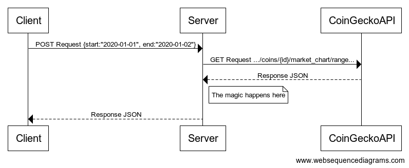
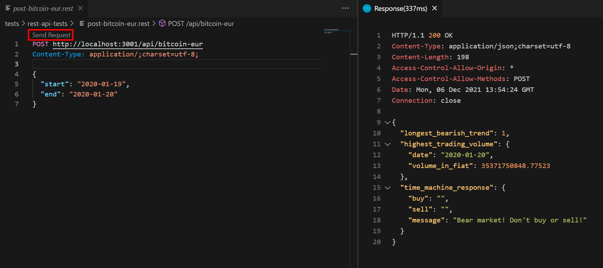

# Crypto API
  
Backend API for cryptocurrency analysis  

---
  
## Test application  
  
You can test how it works: https://sleepy-clarke-e7cad1.netlify.app/.  

---    
  
## Installation  
  
Before installing, download and install Node.js https://nodejs.org/en/download/.  

Download github repository:    
  
```bash
$ git clone https://github.com/Tommi-dev/nodejs-crypto-API-backend.git  
```  
  
Go to the root directory and remove .git:  
  
```bash
$ cd nodejs-crypto-API-backend/  
```  
  
```bash
$ rm -rf .git
```  
  
Install dependencies:  
  
```bash
$ npm install
```  
  
---  

## Quick Start  
   
Audit package dependencies for security vulnerabilities:    
  
```bash
$ npm audit
```  
  
Start the server:  
  
```bash
$ npm start
```  
  
---  
  
## How it works?  
  
`Sequence diagram`  
  
  
---  

## Client POST Request  
  
Clients must send an HTTP POST request to a specific endpoint. The request must be accompanied by a start and end date.  
  
| Key | Value | Description |
| --- | --- | --- |
`start` | `String` | Start date in ISO8601 format
`end` | `String` | End date in ISO8601 format  

Example of request body   
`JSON`  
```json
{
  "start": "2020-01-01",
  "end": "2020-01-06"
}  
```

---  
  
## Server responses to the client POST request  
  
| Key | Value | Description |
| --- | --- | --- |
`highest_trading_volume` | `Object` | Includes date and highest trading volume
`date` | `String` | The date with the highest trading volume in ISO8601 format  
`volume_in_fiat` | `Number` | Trading volume on that day in fiat  
`longest_bearish_trend` | `Number` | The maximum amount of days when price was decreasing in a row  
`time_machine_response` | `Object` | Includes buy, sell and message  
`buy` | `String` | The day to buy in ISO8601 format  
`sell` | `String` | The day to sell in ISO8601 format  
`message` | `String` | If price only decreases in the date range  

Example of response body  
`JSON`  
```json
{
  "highest_trading_volume": {
    "date": "2020-01-04",
    "volume_in_fiat": 27882760176
  },
  "longest_bearish_trend": 1,
  "time_machine_response": {
    "buy": "2020-01-03",
    "sell": "2020-01-05",
    "message": ""
  }
}  
```

---  
   
## Setting up endpoints and scaling  
  
Setting up an endpoint to analyzing the Bitcoin market  

`app.js`  
```js  
...
  /**
   * Routes
   */
  switch (request.url) {

    case '/api/bitcoin-eur': // endpoint
      cryptoToolAPI('bitcoin', 'eur', request, response)
      break

    default:
      unknownEndpoint(request, response)
  }
...
```  
  
If you want to analyze different currencies with other fiats, it’s easy to scale to different endpoints  
  
`app.js`  
```js  
...
  /**
   * Routes
   */
  switch (request.url) {

    case '/api/bitcoin-eur': // endpoint
      cryptoToolAPI('bitcoin', 'eur', request, response)
      break

    case '/api/bitcoin-usd': // endpoint
      cryptoToolAPI('bitcoin', 'usd', request, response)
      break

    case '/api/ethereum-eur': // endpoint
      cryptoToolAPI('ethereum', 'eur', request, response)
      break

    default:
      unknownEndpoint(request, response)
  }
...
```   
  
---  
  
## Tests 
  
1. Download the Visual Studio Code Editor before testing, https://code.visualstudio.com/.  
  
2. Download REST Client-plugin, https://marketplace.visualstudio.com/items?itemName=humao.rest-client.  
  
Execute the unit tests:    
  
```bash
$ npm run test
```  
  
Execute REST API tests:  
  
```bash
$ npm start  
```  
  
`Send Request`  
  
  
---  
  
## Deploying to Heroku  
  
Before deploying, sign up or log in to Heroku https://www.heroku.com/home.  
  
Create Heroku application:  
  
```bash
$ heroku create
```  
  
Move your code to Heroku:  
  
```bash
$ npm run deploy
```  
  